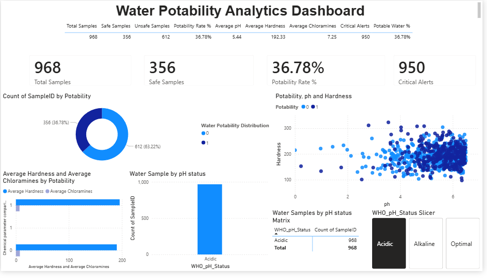

# 💧 Water Potability Analytics Dashboard

## 📌 Project Overview
The Water Potability Analytics Dashboard is an interactive Power BI project developed to analyze water quality and determine the safety of drinking water based on various environmental and chemical parameters.
The dashboard provides insights into water potability by analyzing factors such as pH, hardness, chloramines, sulfate concentration, turbidity, conductivity, organic carbon, dissolved solids, and trihalomethanes. It enables users to identify patterns, monitor water quality, and evaluate drinking water safety through interactive visualizations and KPI metrics.


## 🎯 Objectives
• Analyze water quality data and drinking water safety.
• Identify factors affecting water potability.
• Create an interactive dashboard for data exploration.
• Apply data cleaning, transformation, modeling, and visualization techniques using Power BI.
• Demonstrate data analytics and business intelligence skills.
---

## 🛠️ Tools & Technologies Used
• Power BI Desktop
• Power Query
• DAX (Data Analysis Expressions)
• Data Modeling (Star Schema)
• GitHub
---

## 📂 Dataset Information
The dataset contains water quality measurements collected from multiple water samples.
### Key Attributes
• pH
• Hardness
• Solids
• Chloramines
• Sulfate
• Conductivity
• Organic Carbon
• Trihalomethanes
• Turbidity
• Potability
### Target Variable
• **Potability**
  - 1 = Safe Drinking Water
  - 0 = Unsafe Drinking Water
---

## 🔄 Data Preparation
The following preprocessing steps were performed:
• Imported dataset into Power BI.
• Handled missing values using Power Query.
• Corrected data types.
• Created unique Sample IDs.
• Generated pH classification categories:
  - Acidic
  - Optimal
  - Alkaline
• Built a star schema model using fact and dimension tables.
---

## 📊 Dashboard Features
### KPI Cards
• Total Samples Analyzed
• Safe Water Samples
• Unsafe Water Samples
• Potability Rate (%)
• Critical Contamination Alerts

### Visualizations
• Donut Chart for Potable vs Non-Potable Water
• Scatter Plot (pH vs Hardness)
• Chemical Parameter Comparison Chart
• Water Samples by pH Status
• Matrix Analysis
• Interactive Slicers
---

## 📈 DAX Measures Created
### Total Samples
```DAX
Total Samples =
COUNT(Fact_Water_Samples[SampleID])
```

### Safe Samples
```DAX
Safe Samples =
CALCULATE(
COUNT(Fact_Water_Samples[SampleID]),
Fact_Water_Samples[Potability] = 1
)
```

### Potability Rate %
```DAX
Potability Rate % =
DIVIDE(
[Safe Samples],
[Total Samples],
0
)
```

### Critical Alerts
```DAX
Critical Alerts =
COUNTROWS(
FILTER(
Fact_Water_Samples,
Fact_Water_Samples[Turbidity] > 4.5
||
Fact_Water_Samples[Chloramines] > 4
)
)
```
---

## 🏗️ Data Model
A Star Schema was implemented consisting of:
### Fact Table
• Fact_Water_Samples
### Dimension Tables
• Dim_Calendar
• Dim_pH_Status
This structure improves dashboard performance and follows data warehousing best practices.

---

## 📷 Dashboard Screenshots
### Executive Dashboard

### Water Quality Analysis


---

## 💡 Key Insights
• Identified percentage of potable and non-potable water samples.
• Analyzed the relationship between pH and hardness.
• Detected contamination risk through turbidity and chloramine levels.
• Classified samples according to pH compliance ranges.
• Enabled interactive filtering and exploration of water quality metrics.

---

## 🚀 Learning Outcomes
Through this project, I gained practical experience in:
• Data Cleaning using Power Query
• Data Modeling in Power BI
• DAX Measure Development
• Interactive Dashboard Design
• Business Intelligence Reporting
• Environmental Data Analytics

---

## 📌 Future Enhancements
• Real-time water quality monitoring.
• Integration with IoT sensor data.
• Predictive analytics for water safety.
• Automated alert generation.

---

## 👨‍💻 Author
Ashwini
Power BI | Data Analytics 
